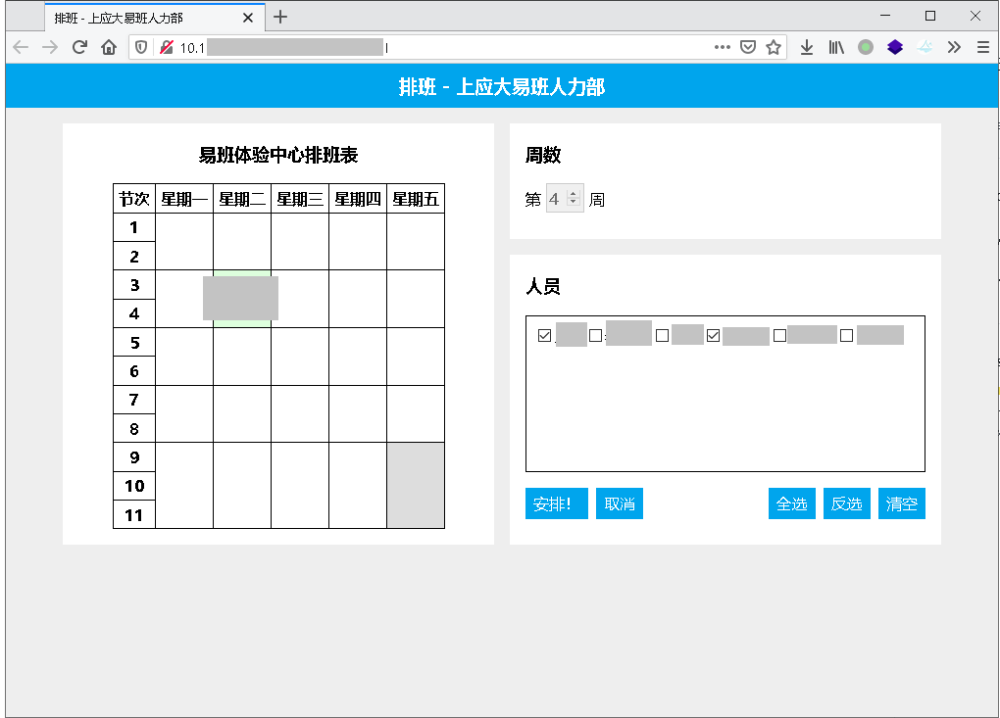

# 排班工具

这儿有一个简单的排班工具，它可以帮助一些学生组织安排值班。

这些脚本是为校易班工作站编写的，用于 20 号楼下的易班体验中心安排部员值班。我们一共有超过 80 名成员，人工排班比较麻烦。
考虑到全自动排班难以考虑诸多因素，且项目周期较短、脚本主要是内部使用，所以决定仅将这些脚本当做辅助，用于排班人员查询某一时间段是否有成员空闲。

该项目地址见 [SIT-Yiban/work-schedule](https://github.com/SIT-Yiban/work-schedule)

排班工具基于**正方教务系统**导出课表编写。

## 界面截图




## 业务流程

1. 收集成员的校园网 SSO 密码（OA密码），每一行的格式为
   ```text
   部门	姓名	账号	密码
   ```
   文件不需要包含标题行，列间使用制表符分隔，命名为 `group.csv`，使用 `UTF-8` 编码。

2. 使用 `export-course.py`，导出成员课表到 `results.txt`。  
   设计的时候没有使用数据库导致数据文件占用空间过大，并且不满足没有数据库范式的一些要求。但是满足我们的需求足够了。

3. 运行 `flask run query.py`，通过发送 `POST` 请求查询人员空闲情况。使用方法见文件首部。

## 使用方法

如前所述，我们写了一个排班工具的示例，供有技术的同学参考。 这里给出了接口的基本使用方法。

请修改 `frontend/schedule.js` 第 80 行为实际接口地址。如这里的 `/query`。
请注意避免请求跨域问题。

### POST /query

**参数**

| 参数 | 类型 | 描述 |
| --- | --- | --------- |
| week | 数字 | 当前第几周 |
| day | 数字 | 当前星期几，范围 `1-7` |
| index | 字符串 | 一个字符串，由 `-` 分隔开两个数字。如 `1-2`，表示查询 `1-2` 节课 |

**请求示例**

```http request
### 查询第 1 周, 周一, 1-2 节有空的人
POST /query
Host: localhost:5000
Content-Type: application/x-www-form-urlencoded
Content-Length: 22
Accept: */*

week=1&day=1&index=1-2
```

**响应示例**

```json
{
   "result": [
      {
         "group": "部门",
         "id": "学号",
         "name": "姓名"
      }
   ],
   "status": 200
}
```

